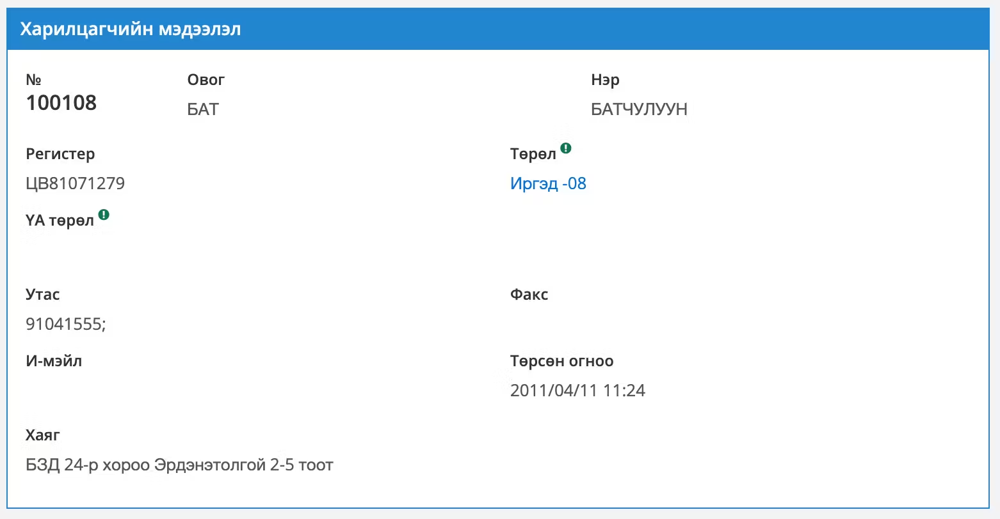

# **ХАРИЛЦАГЧ**	
> 💡 Зээлийн бус харилцагч үүсгэх бол энэ модулийг ашиглана. 

✅️ **Шинээр бүртгэх.** <grey> Шинэ харилцагч бүртгэхдээ, эхлээд тухайн харилцагч өмнө нь данс нээлгэж байсан эсэхийг шалгаж харилцагчийн дугаар авч, түүн дээрээ шинэ данс бүртгүүлнэ. Хэрэв өмнө нь данс нээлгэсэн бол шинээр бүртгэх шаардлагагүй бөгөөд тухайн харилцагчийн код дээр дансны бичлэг нэмнэ. </grey>

 

>✅️ 
**Хайлт.** <grey>Харилцагчийн бүртгэлийн нэгдсэн сангаас харилцагчтай холбоотой талбаруудаар хүснэгтийн толгой хэсэгт хайлт хийнэ. Мөн дансны дугаараар хайх боломжтой. Дэлгэрэнгүй хайлт хийх хэрэгсэлийг **[дэлгэрэнгүй хайлтын хэрэгсэлтэй ажиллах]** хэсгээс харна уу </grey>

 
> ✅️<grey> Толгойн хайлт хийхдээ харилцагчийн үндсэн мэдээллүүдээс тухайн үг оролцсоноор хайна. Өөрөөр хэлбэл: харилцагчийн нэр= ***“БАТ”*** гэж хайхад:***“БАТАА”,”БАТСАЙХАН”,”БАТХҮҮ ”***  гэх мэт бүх ***“БАТ”***оролцсон жагсаалтыг гаргана. Үүнтэй адилаар бусад талбарууд мөн тухайн үг оролцсоноор хайна.
Сонгосон харилцагчийн мэдээллийг дэлгэрэнгүй харахдаа тухайн харилцагчийн мэдээлэл дээр ***double click*** хийх буюу товших, мэдээлэл засах бол үзэгний тэмдэглэгээ дээр дарж орно. Дэлгэрэнгүй мэдээлэл харах цонхруу орсны дараа зүүн дээд хэсгээс ***edit*** товчин дээр дарж засварлах боломжтой. </grey>
 

> Харилцагч шинээр бүртгэх бол баруун дээд булангийн ➕ товчин дээр дарж шинэ харилцагч нэмэх цонхыг дуудна.

> :warning: Харилцагчийн үндсэн мэдээллийг заавал оруулж 💾 товчийг дарж хадгална. 

[дэлгэрэнгүй хайлтын хэрэгсэлтэй ажиллах]: https://rust-lang.github.io/mdBook/

