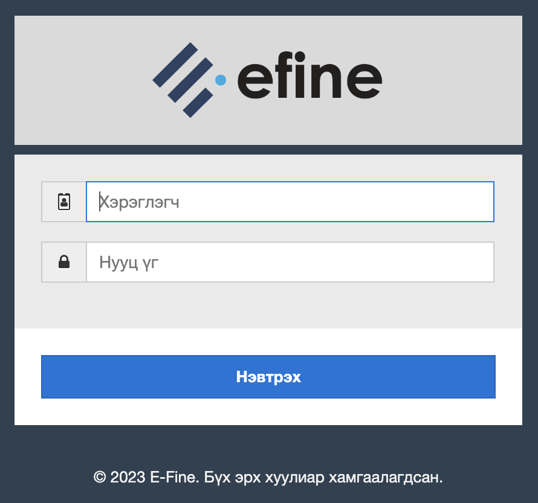
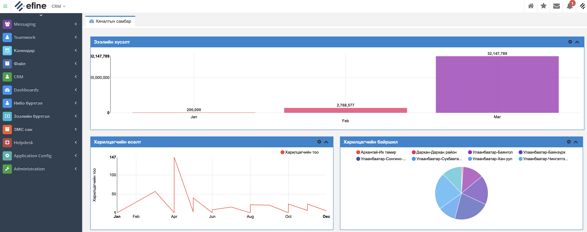

#**СИСТЕМД НЭВТРЭХ**

Системрүү нэвтрэхийн тулд байгууллагын системийн замыг веб хөтөч дээр оруулна.

	Жишээ нь: http://demo.efine.mn:808/test/login.jsp

>Хэрэглэгчийн нэр, нууц үгээ тухайн системд бүртгүүлсэн байх ёстой. Хэрэглэгчийн эрхийг систем хөгжүүлэгчээс үүсгэж өгнө. Хэрэглэгчийн нэр, нууц үгийг зөв оруулснаар  системд нэвтэрнэ. 

>Систем рүү нэвтрэх үед ямар нэгэн алдаа гарвал хөгжүүлэгчид мэдэгдэнэ үү.

 

    Амжилттай нэвтэрсэн үед тухайн хэрэглэгчийн эрх, чиг үүрэгт хамаарах меню харагдана.
    Үндсэн дэлгэц дээр Хянах самбар харагдах ба үүнд ББСБ- ийн санхүүгийн болон зээлийн үндсэн мэдээллүүдийн дашборд байдлаар  харагдана. 

<table>
  <tr>
    <td>

 
    </td>
    <td> 
**Цэсний талаар товчхон** 
 &bull; Харилцагч (Харилцагчдийн жагсаалт) 
 &bull;Данс (Нэрийн данс, Дотоодын болон Тэнцлийн бус дансдын жагсаалт) 
 &bull;Гүйлгээ (Тэнцлийн, тэнцлийн бус гүйлгээ болон бусад гүйлгээ оруулах,  
гүйлгээний хайлт) 
 &bull;Нябо тайлан (Хуулга, Тайлан баланс ) 
 &bull;Гүйлгээний төлөв (гүйлгээний төлөв, системийн тохируулга өөрчлөх командууд байна) 
 &bull;Нябо тохиргоо 
</td>
  </tr>
</table>